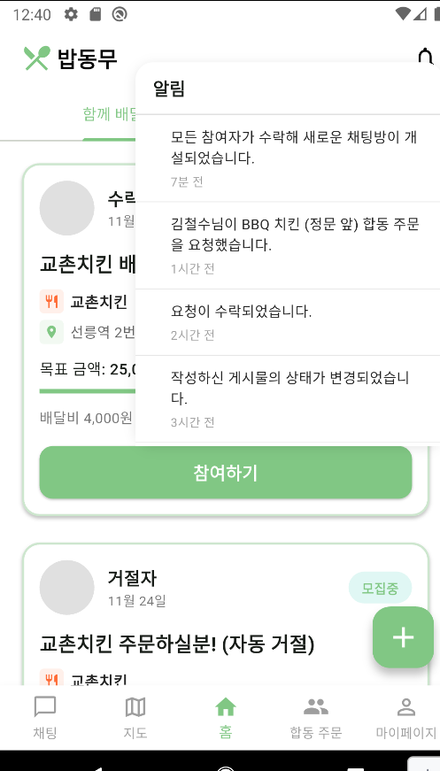

# 밥동무 | 캡스톤디자인 프로젝트

**밥동무**는 캠퍼스 구성원이 배달 주문을 함께 묶어 배달비를 나누고, 식사 모임을 만들 수 있도록 설계한 모바일 앱입니다. 캡스톤디자인 과제로 개발해 내부 테스트에 사용한 프로토타입이며, 대외 서비스로 출시하거나 운영한 적은 없습니다.



## 해결하려는 문제

혼자 주문할 때 부담되는 배달비와 식사 인원 모집의 번거로움을 줄이는 것이 목표입니다. 사용자가 주변의 배달 모집이나 식사 모임을 확인하고, 참여자들과 주문·대화·정산까지 이어가도록 한 흐름으로 구성했습니다.

## 주요 기능

- 배달 공동 주문 및 식사 모임 게시글 작성, 목록, 상세 보기, 참여
- 지도에서 주변 게시글과 장소를 확인하고 대략적인 수령 지점을 선택
- 매장·장소·배달비 기준 합동 주문 매칭, 수락·거절 및 만료 처리
- 주문별 채팅방과 실시간 메시지
- 공용 장바구니, 주문 영수증, 포인트 정산 요청
- 로그인, 프로필 관리, 앱 알림과 선택적 푸시 알림

## 기술 스택

| 영역 | 기술 | 사용 방식 |
|---|---|---|
| 모바일 앱 | Flutter, Dart, Material | 화면, 폼, 상태 흐름, Android 앱 구성 |
| 서버 API | Spring Boot 3, Java 21 | 인증, 게시글, 매칭, 채팅방·장바구니 API |
| 인증·보안 | Spring Security, JWT | 로그인 토큰 발급과 보호된 API/WebSocket 메시지 처리 |
| 데이터 | Spring Data JPA, MariaDB | 사용자, 게시글, 참여, 채팅 및 정산 도메인 저장 |
| 실시간 통신 | STOMP, WebSocket | 채팅방 구독과 실시간 메시지 전달 |
| 위치·지도 | Google Maps Flutter, Geolocator | 지도 표시, 현재 위치와 수령 지점 선택 |
| 알림 | Firebase Cloud Messaging | 선택적 푸시 알림; 기본 설정에서는 비활성화 |

## 기술을 적용한 방식

- Flutter 화면은 API별 서비스 계층으로 분리했습니다. `AuthApi`, `PostApi`, `ChatApi`, `JointOrderApi`, `SharedCartApi`가 REST 요청과 화면 모델 변환을 담당합니다.
- 서버는 게시글·주문·채팅 도메인을 Spring Boot와 JPA로 구성하고, 로그인에는 JWT를 사용합니다. STOMP 채널 인터셉터에서도 토큰을 확인합니다.
- 합동 주문은 매장과 대략적인 장소를 기준으로 후보를 찾고, 참여자의 응답 상태와 만료 시간을 관리한 뒤 공동 채팅방으로 연결합니다.
- 지도 기반 배달 게시글에는 상세 주소를 저장·응답하지 않고 장소 라벨과 소수점 셋째 자리까지의 대략적인 좌표만 사용합니다.
- 테스트용 더미 데이터는 `--dart-define=APP_USE_MOCK_DATA=true`로 선택합니다. 세션 토큰·사용자 ID·프로필 정보와 푸시 토큰은 앱 실행 중 메모리에만 보관합니다.

## 실행 및 설정

프로젝트는 폐기되어 연결 가능한 서버가 없습니다. 앱의 기본 API/WebSocket 주소는 예약된 `example.invalid` 도메인을 사용하므로 외부 서비스에 연결되지 않습니다.

```sh
flutter run --dart-define=APP_USE_MOCK_DATA=true
```

서버를 별도로 실행하려면 `server` 브랜치에서 Java 21과 격리된 데이터베이스를 준비하고 `DB_URL`, `DB_USERNAME`, `DB_PASSWORD`, `JWT_SECRET` 환경 변수를 설정해야 합니다. 서버는 기본적으로 `127.0.0.1:8080`에만 바인딩됩니다.

Firebase는 `APP_ENABLE_FIREBASE=true`와 로컬 `google-services.json`이 있을 때만 사용합니다. Android 지도 키는 패키지명과 서명 인증서로 제한한 뒤, Git에서 무시되는 `android/local.properties`에 `MAPS_API_KEY`로 설정하세요. 서비스 키·계정·실사용 데이터는 저장소에 포함하지 마세요.

## 프로젝트 상태

이 저장소는 캡스톤디자인 결과물의 소스와 내부 테스트용 샘플을 정리한 공개 자료입니다. 현재 운영 중인 서비스나 서버는 없습니다. 원격 통합 테스트는 기본 비활성화되어 있으며, 실행할 경우 폐기 가능한 테스트 서버와 계정만 사용하세요.
